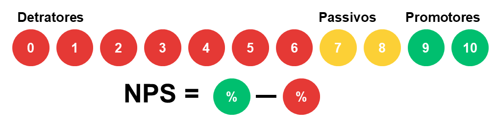

<style>
  body {
    text-align: justify;
  }
</style>

```{r setup, include=FALSE}
# Configurações do knitr
knitr::opts_chunk$set(echo = TRUE, cache = FALSE)
source("./R/pacotes.R")
source("./R/dados.R")
```

---

```{r, echo=FALSE}


```


### 

A satisfação do cliente é um aspecto fundamental para o sucesso de qualquer empresa. Compreender as expectativas, necessidades e percepções dos nossos clientes é essencial para oferecer um serviço de qualidade e criar relacionamentos. Nesse contexto, a pesquisa de satisfação do cliente desempenha um papel crucial.

Nesta seção, abordaremos os principais resultados obtidos na pesquisa através dos índices **NPS** e **CSAT**, que visam mensurar o quanto o cliente está satisfeito em relação aos nossos produtos e serviços. 

---

### O que é NPS e CSAT?

Dois indicadores bastante eficientes e importantes na avaliação de satisfação do clientes são o NPS e CSAT, que vamos discorrer ao longo desta seção.

#### **1. NPS - Net Promoter Score**

O <i> Net Promoter Score </i> é uma métrica usada nos programas de experiência do cliente para medir a fidelidade dos clientes a uma empresa. O Net Promoter Score costuma ser medido com pesquisas NPS de pergunta única e retratado em forma de uma pontuação de -100 à 100. Quanto maior o NPS, melhor.

O <i> Net Promoter Score </i> é considerado o padrão ouro das métricas de experiência do cliente. Desenvolvido em 2003 pela **Bain and Company**, ele hoje é usado por milhões de empresas para monitorar a percepção dos clientes a respeito da marca através de pesquisas NPS.

A pesquisa NPS é feita com uma pergunta simples:

Qual é a probabilidade de você recomendar a empresa o produto ou serviço para um amigo?

Os participantes dão uma nota entre 0 e 10, sendo 0 nada provável e 10 muito provável e, dependendo das respostas, eles entram em uma das 3 categorias de Net Promoter Score abaixo:

* Quem dá uma pontuação de 9 ou 10 é considerado promotor. Para a pesquisa NPS, os promotores são pessoas que costumam ser entusiastas da marca.
* Quem dá uma pontuação de 7 ou 8 é considerado passivo. Para a pesquisa NPS, são as pessoas que estão satisfeitas com o serviço, mas não a ponto de serem promotoras.
* Quem dá uma pontuação de 0 a 6 é considerado detrator da marca. Para a pesquisa NPS, são pessoas insatisfeitas que não devem comprar o seu produto novamente e podem até incentivar outras pessoas a não comprar.

Para se obter o índice de NPS, basta subtrair o percentual de detratores do percentual de promotores.




#### **2. CSAT - Customer Satisfaction Score**

O <i> Customer Satisfaction Score </i> é uma métrica utilizada para saber a porcentagem de clientes satisfeitos com sua empresa, normalmente identificada por uma pequena pesquisa de satisfação.

Seu uso pode facilitar a descoberta de informações sobre as etapas da jornada do cliente e qual experiência ele teve nos diferentes pontos de contato com a marca.

A marca pode utilizar o CSAT para descobrir se o cliente está feliz com o produto ou serviço contratado, o atendimento prestado pela empresa, a assistência pós compra, entre outros. 

Após um contato com sua marca, o cliente pode responder a algumas perguntas simples como: 

* Qual o seu nível de satisfação com o nosso produto? 
* Qual o seu nível de satisfação com a entrega realizada?
* Qual o seu nível de satisfação com o atendimento que acabou de receber? 

Para a resposta, a empresa pode oferecer duas modalidades: 

* Escala numérica: avaliação por notas de 0 a 10;
* Escala de percepção: avaliação por termos como “satisfeito”, “indiferente”, “pouco satisfeito”, “ótimo”, “regular”, “ruim”.

Além de coletar o feedback dos usuários, o CSAT pode evidenciar processos que precisam de melhorias dentro da sua empresa.

Entre os maiores benefícios de realizar o CSAT, podemos citar:

* Fácil implementação e baixo custo
* Fortalecimento da relação entre cliente e empresa
* Dados e insights para melhoria de processos e serviços


---

### NPS

Na análise do <i> Net Promoter Score </i> é possível observar que um total de **`r Promotores_total`** donos de veículos tem uma Recomendação positiva, performando **`r Promotores`%**, enquanto que os Detratores somaram **`r Detratores_total`** representando **`r Detratores`%**. Dessa forma, o índice calculado da amostra foi de **`r NPS_indice`%**.


#### {.tabset .tabset-fade .tabset-pills}

```{r, comment=FALSE, message=FALSE, fig.align='center', warning=TRUE, echo = FALSE, warning=FALSE, width=10}

# Tabela NPS Marca
NPS_marca <- DT::datatable(
  dados_NPS_Geral2[,c('Marca',
                     'Promotores',
                     'Passivos',
                     'Detratores',
                     'Total',
                     'NPS')],  
              class = 'cell-border stripe',
              rownames = F,
              #filter = 'top',
              editable = T)  %>%
  formatStyle(columns = c("Marca"), width = "40%") %>%
  formatStyle(columns = c('Promotores'), width = "12.5%") %>%
  formatStyle(columns = c('Passivos'), width = "12.5%") %>%
  formatStyle(columns = c('Detratores'), width = "12.5%") %>%
  formatStyle(columns = c('Total'), width = "12.5%") %>%
  formatStyle(columns = c('NPS'), width = "10%")

# Tabela NPS Carro
NPS_carro <- DT::datatable(
  dados_NPS_Geral[,c('Marca', 
                     'Carro',
                     'Promotores',
                     'Passivos',
                     'Detratores',
                     'Total',
                     'NPS')],  
              class = 'cell-border stripe',
              rownames = F,
              #filter = 'top',
              editable = T)  %>%
  formatStyle(columns = c("Marca"), width = "20%") %>%
  formatStyle(columns = c('Carro'), width = "20%") %>%
  formatStyle(columns = c('Promotores'), width = "12.5%") %>%
  formatStyle(columns = c('Passivos'), width = "12.5%") %>%
  formatStyle(columns = c('Detratores'), width = "12.5%") %>%
  formatStyle(columns = c('Total'), width = "12.5%") %>%
  formatStyle(columns = c('NPS'), width = "10%")

# Criar o tabsetPanel com as guias para cada ano
tabsetPanel(
  tabPanel('Tabela NPS por Marca', NPS_marca),
  tabPanel('Tabela NPS por Veículo', NPS_carro)
)

```

#### {.tabset .tabset-fade .tabset-pills}

```{r, comment=FALSE, message=FALSE, fig.align='center', warning=TRUE, echo = FALSE, warning=FALSE, width=10}

rosca_nps <- plot_ly(
  data = dados_NPS,
  labels = ~Class_NPS,
  values = ~Valor,
  type = "pie",
  hole = 0.5, 
  marker = list(colors = ~cores_NPS),  
  textposition = "auto",
  hoverinfo = "text+percent",
  text = ~paste(Class_NPS),
  textinfo = "percent"
)

# Layout do gráfico
layout <- list(
  title = "Resultado NPS Geral",
  showlegend = TRUE,
  legend = list(
    x = 1,
    y = 0.5
  )
)

## Gráfico colunas empilhadas por marca
graph_nps <- plot_ly(
  data = dados_NPS_marca,
  x = ~marca, 
  y = ~freq, 
  type = 'bar',
  #name = ~Class_NPS, 
  color = ~Class_NPS,
  colors = c("Promotores" = color_promotores,
             "Passivos" = color_passivos,
             "Detratores" = color_detratores),
  hovertemplate = ~paste0(Class_NPS, ": ", freq, "%")) %>%
  layout(
    title = list(
      text = "NPS por Marca",
      y = 0.95  
    ),
    xaxis = list(title = "Marca"),
    yaxis = list(title = "Frequência", range = c(0, 110)),
    barmode = "stack",
    showlegend = TRUE
  )


# Chevrolet
graph_nps_chevrolet <- plot_ly(
  data = subset(dados_NPS_carro, marca == 'Chevrolet'),
  x = ~carro, 
  y = ~freq, 
  type = 'bar',
  #name = ~Class_NPS, 
  color = ~Class_NPS,
  colors = c("Promotores" = color_promotores,
             "Passivos" = color_passivos,
             "Detratores" = color_detratores),
  hovertemplate = ~paste0(Class_NPS, ": ", freq, "%")) %>%
  layout(
    title = list(
      text = "NPS Veículos Chevrolet",
      y = 0.95  
    ),
    xaxis = list(title = "Veículo"),
    yaxis = list(title = "Frequência", range = c(0, 110)),
    barmode = "stack",
    showlegend = TRUE
  )

# Fiat
graph_nps_fiat <- plot_ly(
  data = subset(dados_NPS_carro, marca == 'Fiat'),
  x = ~carro, 
  y = ~freq, 
  type = 'bar',
  #name = ~Class_NPS, 
  color = ~Class_NPS,
  colors = c("Promotores" = color_promotores,
             "Passivos" = color_passivos,
             "Detratores" = color_detratores),
  hovertemplate = ~paste0(Class_NPS, ": ", freq, "%")) %>%
  layout(
    title = list(
      text = "NPS Veículos Fiat",
      y = 0.95  
    ),
    xaxis = list(title = "Veículo"),
    yaxis = list(title = "Frequência", range = c(0, 110)),
    barmode = "stack",
    showlegend = TRUE
  )

# Ford
graph_nps_ford <- plot_ly(
  data = subset(dados_NPS_carro, marca == 'Ford'),
  x = ~carro, 
  y = ~freq, 
  type = 'bar',
  #name = ~Class_NPS, 
  color = ~Class_NPS,
  colors = c("Promotores" = color_promotores,
             "Passivos" = color_passivos,
             "Detratores" = color_detratores),
  hovertemplate = ~paste0(Class_NPS, ": ", freq, "%")) %>%
  layout(
    title = list(
      text = "NPS Veículos Ford",
      y = 0.95  
    ),
    xaxis = list(title = "Veículo"),
    yaxis = list(title = "Frequência", range = c(0, 110)),
    barmode = "stack",
    showlegend = TRUE
  )

# Honda
graph_nps_honda <- plot_ly(
  data = subset(dados_NPS_carro, marca == 'Honda'),
  x = ~carro, 
  y = ~freq, 
  type = 'bar',
  #name = ~Class_NPS, 
  color = ~Class_NPS,
  colors = c("Promotores" = color_promotores,
             "Passivos" = color_passivos,
             "Detratores" = color_detratores),
  hovertemplate = ~paste0(Class_NPS, ": ", freq, "%")) %>%
  layout(
    title = list(
      text = "NPS Veículos Honda",
      y = 0.95  
    ),
    xaxis = list(title = "Veículo"),
    yaxis = list(title = "Frequência", range = c(0, 110)),
    barmode = "stack",
    showlegend = TRUE
  )

# Hyundai
graph_nps_hyundai <- plot_ly(
  data = subset(dados_NPS_carro, marca == 'Hyundai'),
  x = ~carro, 
  y = ~freq, 
  type = 'bar',
  #name = ~Class_NPS, 
  color = ~Class_NPS,
  colors = c("Promotores" = color_promotores,
             "Passivos" = color_passivos,
             "Detratores" = color_detratores),
  hovertemplate = ~paste0(Class_NPS, ": ", freq, "%")) %>%
  layout(
    title = list(
      text = "NPS Veículos Hyundai",
      y = 0.95  
    ),
    xaxis = list(title = "Veículo"),
    yaxis = list(title = "Frequência", range = c(0, 110)),
    barmode = "stack",
    showlegend = TRUE
  )

# JAC
graph_nps_jac <- plot_ly(
  data = subset(dados_NPS_carro, marca == 'JAC'),
  x = ~carro, 
  y = ~freq, 
  type = 'bar',
  #name = ~Class_NPS, 
  color = ~Class_NPS,
  colors = c("Promotores" = color_promotores,
             "Passivos" = color_passivos,
             "Detratores" = color_detratores),
  hovertemplate = ~paste0(Class_NPS, ": ", freq, "%")) %>%
  layout(
    title = list(
      text = "NPS Veículos JAC",
      y = 0.95  
    ),
    xaxis = list(title = "Veículo"),
    yaxis = list(title = "Frequência", range = c(0, 110)),
    barmode = "stack",
    showlegend = TRUE
  )

# Renaut
graph_nps_renault <- plot_ly(
  data = subset(dados_NPS_carro, marca == 'Renault'),
  x = ~carro, 
  y = ~freq, 
  type = 'bar',
  #name = ~Class_NPS, 
  color = ~Class_NPS,
  colors = c("Promotores" = color_promotores,
             "Passivos" = color_passivos,
             "Detratores" = color_detratores),
  hovertemplate = ~paste0(Class_NPS, ": ", freq, "%")) %>%
  layout(
    title = list(
      text = "NPS Veículos Renault",
      y = 0.95  
    ),
    xaxis = list(title = "Veículo"),
    yaxis = list(title = "Frequência", range = c(0, 110)),
    barmode = "stack",
    showlegend = TRUE
  )

# Volkswagen
graph_nps_volkswagen <- plot_ly(
  data = subset(dados_NPS_carro, marca == 'Volkswagen'),
  x = ~carro, 
  y = ~freq, 
  type = 'bar',
  #name = ~Class_NPS, 
  color = ~Class_NPS,
  colors = c("Promotores" = color_promotores,
             "Passivos" = color_passivos,
             "Detratores" = color_detratores),
  hovertemplate = ~paste0(Class_NPS, ": ", freq, "%")) %>%
  layout(
    title = list(
      text = "NPS Veículos Volkswagen",
      y = 0.95  
    ),
    xaxis = list(title = "Veículo"),
    yaxis = list(title = "Frequência", range = c(0, 110)),
    barmode = "stack",
    showlegend = TRUE
  )


# Criar o tabsetPanel com as guias para cada ano
tabsetPanel(
  tabPanel('NPS Geral', rosca_nps),
  tabPanel('NPS por Marca', graph_nps),
  tabPanel('Chevrolet', graph_nps_chevrolet),
  tabPanel('Fiat', graph_nps_fiat),
  tabPanel('Ford', graph_nps_ford),
  tabPanel('Honda', graph_nps_honda),
  tabPanel('Hyundai', graph_nps_hyundai),
  tabPanel('JAC', graph_nps_jac),
  tabPanel('Renault', graph_nps_renault),
  tabPanel('Volkswagen', graph_nps_volkswagen)
)

```

---

```{r, echo=FALSE}

```

### CSAT

Para fins de melhor visualização dos dados, optou-se pela transformação da escala numérica em uma escala de percepção. Diante disso, atribuísse os seguintes valores às categorias:

1. Muito Insatisfeito: [0-2)
2. Insatisfeito: [2-4)
3. Neutro: [4-6]
4. Satisfeito: (6-8]
5. Muito Satisfeito: (8-10]

#### {.tabset .tabset-fade .tabset-pills}

```{r, comment=FALSE, message=FALSE, fig.align='center', warning=TRUE, echo = FALSE, warning=FALSE, width=10}

# Tabela NPS Marca
CSAT_marca <- DT::datatable(
  dados_CSAT_Geral2[,c('Marca',
                     'Muito Satisfeito',
                     'Satisfeito',
                     'Neutro',
                     'Insatisfeito',
                     'Muito Insatisfeito',
                     'Total')],  
              class = 'cell-border stripe',
              rownames = F,
              #filter = 'top',
              editable = T)  %>%
  formatStyle(columns = c("Marca"), width = "40%") %>%
  formatStyle(columns = c('Muito Satisfeito'), width = "10%") %>%
  formatStyle(columns = c('Satisfeito'), width = "10%") %>%
  formatStyle(columns = c('Neutro'), width = "10%") %>%
  formatStyle(columns = c('Insatisfeito'), width = "10%") %>%
  formatStyle(columns = c('Muito Insatisfeito'), width = "10%") %>%
  formatStyle(columns = c('Total'), width = "10%")

# Tabela NPS Carro
CSAT_carro <- DT::datatable(
  dados_CSAT_Geral[,c('Marca',
                     'Carro',
                     'Muito Satisfeito',
                     'Satisfeito',
                     'Neutro',
                     'Insatisfeito',
                     'Muito Insatisfeito',
                     'Total')],   
              class = 'cell-border stripe',
              rownames = F,
              #filter = 'top',
              editable = T)  %>%
  formatStyle(columns = c("Marca"), width = "20%") %>%
  formatStyle(columns = c("Carro"), width = "20%") %>%
  formatStyle(columns = c('Muito Satisfeito'), width = "10%") %>%
  formatStyle(columns = c('Satisfeito'), width = "10%") %>%
  formatStyle(columns = c('Neutro'), width = "10%") %>%
  formatStyle(columns = c('Insatisfeito'), width = "10%") %>%
  formatStyle(columns = c('Muito Insatisfeito'), width = "10%") %>%
  formatStyle(columns = c('Total'), width = "10%")

# Criar o tabsetPanel com as guias para cada ano
tabsetPanel(
  tabPanel('Tabela CSAT por Marca', CSAT_marca),
  tabPanel('Tabela CSAT por Veículo', CSAT_carro)
)

```

#### {.tabset .tabset-fade .tabset-pills}

```{r, comment=FALSE, message=FALSE, fig.align='center', warning=TRUE, echo = FALSE, warning=FALSE, width=10}

rosca_CSAT <- plot_ly(
  data = dados_CSAT_marca,
  labels = ~Class_CSAT,
  values = ~Valor,
  type = "pie",
  hole = 0.5, 
  marker = list(colors = ~cores_CSAT),  
  textposition = "auto",
  hoverinfo = "text+percent",
  text = ~paste(Class_CSAT),
  textinfo = "percent"
)

# Layout do gráfico
layout <- list(
  title = "Resultado CSAT Geral",
  showlegend = TRUE,
  legend = list(
    x = 1,
    y = 0.5
  )
)


# Definir a ordem das categorias do CSAT
csat_order <- c("Muito Insatisfeito", "Insatisfeito", "Neutro", "Satisfeito", "Muito Satisfeito")

# Converter a coluna Class_CSAT para um fator com a ordem desejada
dados_CSAT_marca$Class_CSAT <- factor(dados_CSAT_marca$Class_CSAT, levels = csat_order)
dados_CSAT_carro$Class_CSAT <- factor(dados_CSAT_carro$Class_CSAT, levels = csat_order)

## Gráfico colunas empilhadas por marca
graph_CSAT <- plot_ly(
  data = dados_CSAT_marca,
  x = ~Marca, 
  y = ~freq, 
  type = 'bar',
  #orientation = 'h',
  color = ~Class_CSAT,
  colors = c("Muito Satisfeito" = color_mtosatisfeito,
             "Satisfeito" = color_satisfeito,
             "Neutro" = color_neutro,
             "Insatisfeito" = color_insatisfeito,
             "Muito Insatisfeito" = color_mtoinsatisfeito),
  hovertemplate = ~paste0(Class_CSAT, ": ", freq, "%")
) %>%
  layout(
    title = list(
      text = "CSAT por Marca",
      y = 0.95  
    ),
    xaxis = list(title = "Marca"),
    yaxis = list(title = "Frequência", range = c(0, 110)),
    barmode = "stack",
    showlegend = TRUE
  )


# Chevrolet
csat_chevrolet <- subset(dados_CSAT_carro, Marca == "Chevrolet")

graph_csat_chevrolet <- plot_ly(
  data = csat_chevrolet,
  x = ~Carro, 
  y = ~freq, 
  type = 'bar',
  #name = ~Class_NPS, 
  color = ~Class_CSAT,
  colors = c("Muito Satisfeito" = color_mtosatisfeito,
             "Satisfeito" = color_satisfeito,
             "Neutro" = color_neutro,
             "Insatisfeito" = color_insatisfeito,
             "Muito Insatisfeito" = color_mtoinsatisfeito),
  hovertemplate = ~paste0(Class_CSAT, ": ", freq, "%")) %>%
  layout(
    title = list(
      text = "CSAT Veículos Chevrolet",
      y = 0.95  
    ),
    xaxis = list(title = "Veículo"),
    yaxis = list(title = "Frequência", range = c(0, 110)),
    barmode = "stack",
    showlegend = TRUE
  )

# Fiat
csat_fiat <- subset(dados_CSAT_carro, Marca == "Fiat")

graph_csat_fiat <- plot_ly(
  data = csat_fiat,
  x = ~Carro, 
  y = ~freq, 
  type = 'bar',
  #name = ~Class_NPS, 
  color = ~Class_CSAT,
  colors = c("Muito Satisfeito" = color_mtosatisfeito,
             "Satisfeito" = color_satisfeito,
             "Neutro" = color_neutro,
             "Insatisfeito" = color_insatisfeito,
             "Muito Insatisfeito" = color_mtoinsatisfeito),
  hovertemplate = ~paste0(Class_CSAT, ": ", freq, "%")) %>%
  layout(
    title = list(
      text = "CSAT Veículos Fiat",
      y = 0.95  
    ),
    xaxis = list(title = "Veículo"),
    yaxis = list(title = "Frequência", range = c(0, 110)),
    barmode = "stack",
    showlegend = TRUE
  )

# Ford
csat_ford <- subset(dados_CSAT_carro, Marca == "Ford")

graph_csat_ford <- plot_ly(
  data = csat_ford,
  x = ~Carro, 
  y = ~freq, 
  type = 'bar',
  #name = ~Class_NPS, 
  color = ~Class_CSAT,
  colors = c("Muito Satisfeito" = color_mtosatisfeito,
             "Satisfeito" = color_satisfeito,
             "Neutro" = color_neutro,
             "Insatisfeito" = color_insatisfeito,
             "Muito Insatisfeito" = color_mtoinsatisfeito),
  hovertemplate = ~paste0(Class_CSAT, ": ", freq, "%")) %>%
  layout(
    title = list(
      text = "CSAT Veículos Ford",
      y = 0.95  
    ),
    xaxis = list(title = "Veículo"),
    yaxis = list(title = "Frequência", range = c(0, 110)),
    barmode = "stack",
    showlegend = TRUE
  )

# Honda
csat_honda <- subset(dados_CSAT_carro, Marca == "Honda")

graph_csat_honda <- plot_ly(
  data = csat_honda,
  x = ~Carro, 
  y = ~freq, 
  type = 'bar',
  #name = ~Class_NPS, 
  color = ~Class_CSAT,
  colors = c("Muito Satisfeito" = color_mtosatisfeito,
             "Satisfeito" = color_satisfeito,
             "Neutro" = color_neutro,
             "Insatisfeito" = color_insatisfeito,
             "Muito Insatisfeito" = color_mtoinsatisfeito),
  hovertemplate = ~paste0(Class_CSAT, ": ", freq, "%")) %>%
  layout(
    title = list(
      text = "CSAT Veículos Honda",
      y = 0.95  
    ),
    xaxis = list(title = "Veículo"),
    yaxis = list(title = "Frequência", range = c(0, 110)),
    barmode = "stack",
    showlegend = TRUE
  )

# Hyundai
csat_hyundai <- subset(dados_CSAT_carro, Marca == "Hyundai")

graph_csat_hyundai <- plot_ly(
  data = csat_hyundai,
  x = ~Carro, 
  y = ~freq, 
  type = 'bar',
  #name = ~Class_NPS, 
  color = ~Class_CSAT,
  colors = c("Muito Satisfeito" = color_mtosatisfeito,
             "Satisfeito" = color_satisfeito,
             "Neutro" = color_neutro,
             "Insatisfeito" = color_insatisfeito,
             "Muito Insatisfeito" = color_mtoinsatisfeito),
  hovertemplate = ~paste0(Class_CSAT, ": ", freq, "%")) %>%
  layout(
    title = list(
      text = "CSAT Veículos Hyundai",
      y = 0.95  
    ),
    xaxis = list(title = "Veículo"),
    yaxis = list(title = "Frequência", range = c(0, 110)),
    barmode = "stack",
    showlegend = TRUE
  )

# JAC
csat_jac <- subset(dados_CSAT_carro, Marca == "JAC")

graph_csat_jac <- plot_ly(
  data = csat_jac,
  x = ~Carro, 
  y = ~freq, 
  type = 'bar',
  #name = ~Class_NPS, 
  color = ~Class_CSAT,
  colors = c("Muito Satisfeito" = color_mtosatisfeito,
             "Satisfeito" = color_satisfeito,
             "Neutro" = color_neutro,
             "Insatisfeito" = color_insatisfeito,
             "Muito Insatisfeito" = color_mtoinsatisfeito),
  hovertemplate = ~paste0(Class_CSAT, ": ", freq, "%")) %>%
  layout(
    title = list(
      text = "CSAT Veículos JAC"),
    xaxis = list(title = "Veículo"),
    yaxis = list(title = "Frequência"),
    barmode = "stack",
    showlegend = TRUE
  )

# Renaut
csat_renault <- subset(dados_CSAT_carro, Marca == "Renault")

graph_csat_renault <- plot_ly(
  data = csat_renault,
  x = ~Carro, 
  y = ~freq, 
  type = 'bar',
  #name = ~Class_NPS, 
  color = ~Class_CSAT,
  colors = c("Muito Satisfeito" = color_mtosatisfeito,
             "Satisfeito" = color_satisfeito,
             "Neutro" = color_neutro,
             "Insatisfeito" = color_insatisfeito,
             "Muito Insatisfeito" = color_mtoinsatisfeito),
  hovertemplate = ~paste0(Class_CSAT, ": ", freq, "%")) %>%
  layout(
    title = list(
      text = "CSAT Veículos Renault",
      y = 0.95  
    ),
    xaxis = list(title = "Veículo"),
    yaxis = list(title = "Frequência", range = c(0, 110)),
    barmode = "stack",
    showlegend = TRUE
  )

# Volkswagen
csat_volkswagen <- subset(dados_CSAT_carro, Marca == "Volkswagen")

graph_csat_volkswagen <- plot_ly(
  data = csat_volkswagen,
  x = ~Carro, 
  y = ~freq, 
  type = 'bar',
  #name = ~Class_NPS, 
  color = ~Class_CSAT,
  colors = c("Muito Satisfeito" = color_mtosatisfeito,
             "Satisfeito" = color_satisfeito,
             "Neutro" = color_neutro,
             "Insatisfeito" = color_insatisfeito,
             "Muito Insatisfeito" = color_mtoinsatisfeito),
  hovertemplate = ~paste0(Class_CSAT, ": ", freq, "%")) %>%
  layout(
    title = list(
      text = "CSAT Veículos Volkswagen",
      y = 0.95  
    ),
    xaxis = list(title = "Veículo"),
    yaxis = list(title = "Frequência", range = c(0, 110)),
    barmode = "stack",
    showlegend = TRUE
  )

# Criar o tabsetPanel com as guias para cada ano
tabsetPanel(
  tabPanel('CSAT Geral', rosca_CSAT),
  tabPanel('CSAT por Marca', graph_CSAT),
  tabPanel('Chevrolet', graph_csat_chevrolet),
  tabPanel('Fiat', graph_csat_fiat),
  tabPanel('Ford', graph_csat_ford),
  tabPanel('Honda', graph_csat_honda),
  tabPanel('Hyundai', graph_csat_hyundai),
  tabPanel('JAC', graph_csat_jac),
  tabPanel('Renault', graph_csat_renault),
  tabPanel('Volkswagen', graph_csat_volkswagen)
)

```